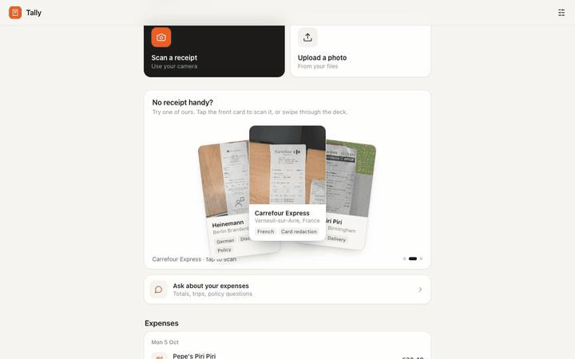
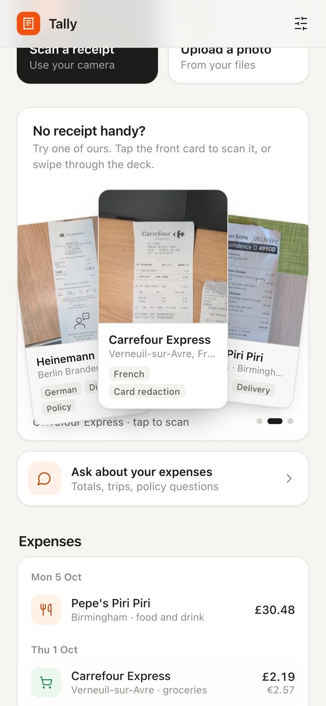
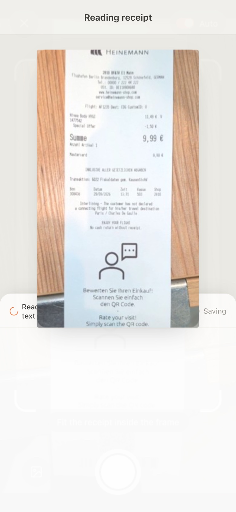
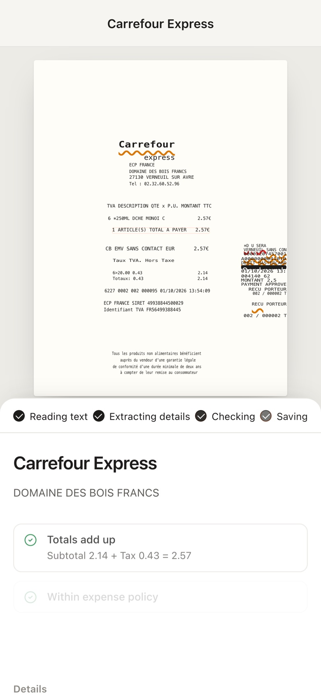
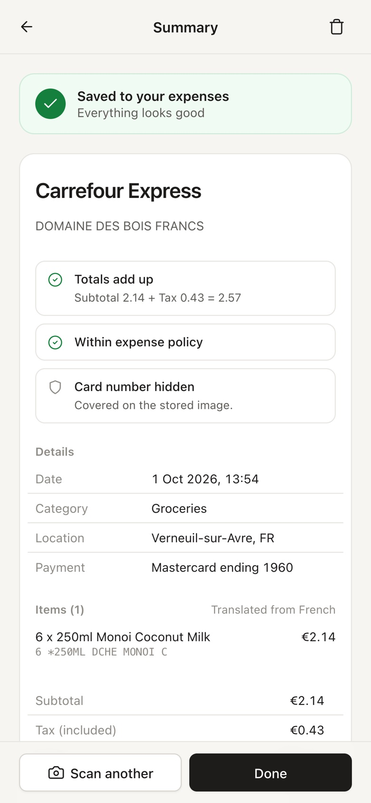
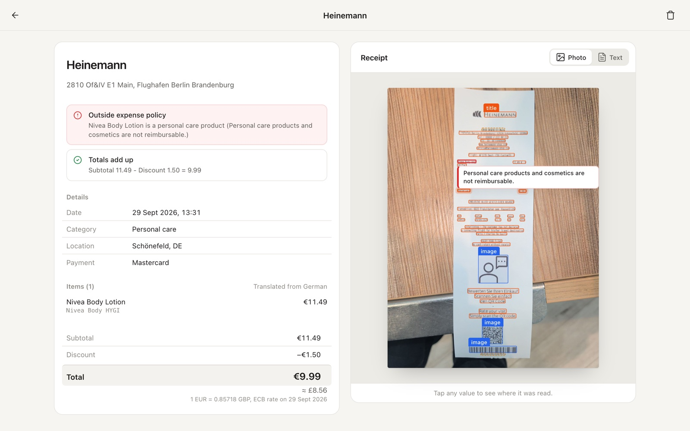
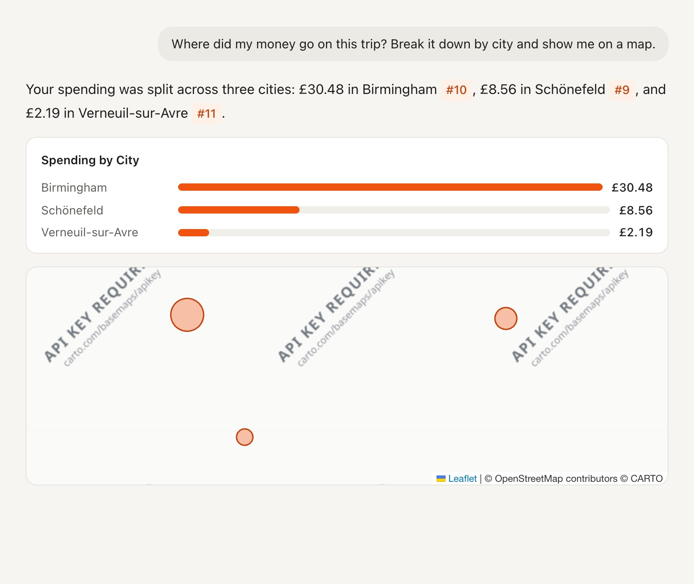
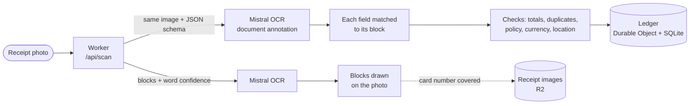
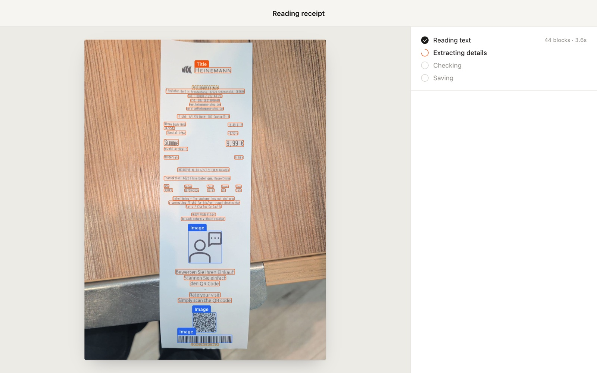
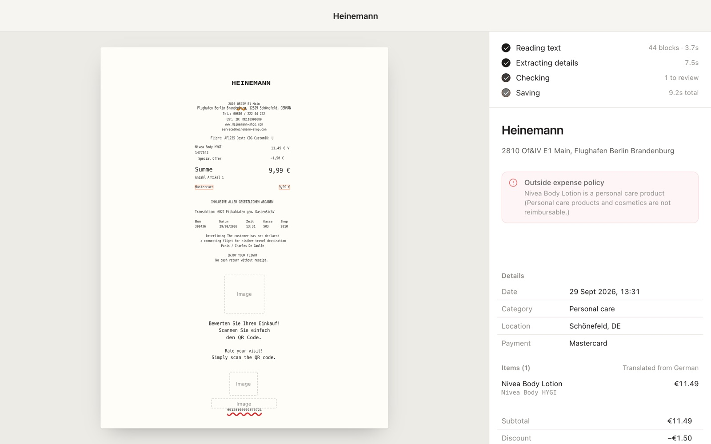

<div align="center">

# Tally

**Point your phone at a receipt. Get a checked, categorised expense a few seconds later.**

A demo of [Mistral OCR](https://docs.mistral.ai/studio/document-processing/basic_ocr) running on [Cloudflare Workers](https://developers.cloudflare.com/workers/).



</div>

## What it does

<table>
<tr>
<td align="center" width="25%"><br><sub>Scan, upload, or try a sample</sub></td>
<td align="center" width="25%"><br><sub>Captures when the receipt is steady</sub></td>
<td align="center" width="25%"><br><sub>Reads and extracts it</sub></td>
<td align="center" width="25%"><br><sub>Saves it, with review notes</sub></td>
</tr>
</table>

- **Reads the whole receipt.** Every block of text is outlined on the photo in reading order. Low-confidence words get a dashed outline, so you can see what the model was unsure about.
- **Turns it into an expense.** Merchant, date, location, line items (translated into English), discounts, tax, tip and total.
- **Shows where every value came from.** Hover or tap any field to highlight the line it was read from.
- **Reviews it for you.** Checks that the totals add up, flags likely duplicates, applies your expense policy, and converts foreign currencies at the rate on the receipt date.
- **Covers card numbers** before the photo is stored.
- **Answers questions** about your spending, with charts, a map and links to the receipts behind each number.





No receipt to hand? The home screen has three samples: a UK delivery order, a French supermarket receipt, and a German airport shop.

## How it works



1. The browser sends the photo to the Worker, which streams each result back as soon as it's ready.
2. Two Mistral OCR calls run in parallel on the same image. One returns text blocks, their positions and per-word confidence in a second or two, so the screen can start drawing. The other uses a JSON schema to return the structured expense a few seconds later.
3. The Worker matches every extracted value to the block it was read from. That's what powers the highlight when you hover a field.
4. It then reviews the expense:
   - checks the arithmetic,
   - looks for a matching receipt already in the ledger,
   - applies the expense policy using Mistral Medium,
   - converts the currency at the ECB rate ([Frankfurter](https://frankfurter.dev)),
   - places the city on a map ([OpenStreetMap](https://nominatim.org)).
5. The expense is saved in a Durable Object's SQLite database. The browser covers any card number and uploads that copy of the photo to R2.

<table>
<tr>
<td width="50%"></td>
<td width="50%"></td>
</tr>
<tr>
<td align="center"><sub>Blocks, types and confidence, about 2 s in</sub></td>
<td align="center"><sub>Clean text, fields and review notes</sub></td>
</tr>
</table>

The app is plain HTML, CSS and JavaScript with no build step.

```
src/            Worker: API routes, OCR pipeline, checks, ledger (Durable Object)
public/         The app: index.html, styles.css, js/
public/samples/ Sample receipts used by the deck on the home screen
```

## Run it locally

You need [Node.js](https://nodejs.org) 22 or later and a [Mistral API key](https://docs.mistral.ai/getting-started/quickstarts/studio/activate-and-generate-api-key). You don't need a Cloudflare account: the Durable Object and R2 storage run locally.

```bash
git clone https://github.com/megaconfidence/tally.git
cd tally
npm install
echo "MISTRAL_API_KEY=your-key-here" > .env
npm run dev
```

Open <http://localhost:8787> and pick one of the sample receipts.

### Use your phone's camera

Browsers only allow the camera on `localhost` or over HTTPS. To scan with your phone, start the dev server with a tunnel and open the `https://…trycloudflare.com` address it prints:

```bash
npx wrangler dev --tunnel
```

### Settings

| What | Where | Default |
| --- | --- | --- |
| OCR model | `OCR_MODEL` in `wrangler.jsonc` | `mistral-ocr-4-1` |
| Model for the policy check and for questions | `POLICY_MODEL`, `ASK_MODEL` in `wrangler.jsonc` | `mistral-medium-latest` |
| Home currency and expense policy | Settings in the app | GBP, a four-rule sample policy |
